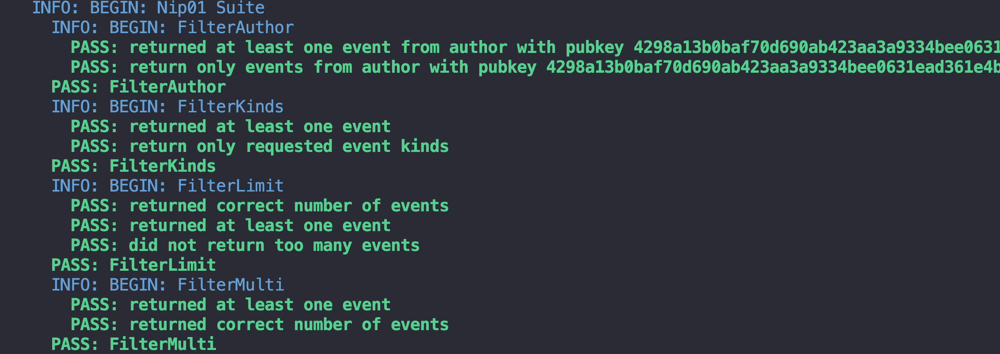

# @nostrwatch/auditor

A framework to test relays against their advertised supported NIPs. (name pending)

**Features**
- Minimal boilerplate
- Familiar testing patterns
- Overloads for more advanced testing cases
- Nip Support detection via NIP-11
- Live data Sampler for more accurate test results. 




# Basic usage

```js
import Auditor from "@nostrwatch/auditor"

const relay = "wss://relay.damus.io"
const audit = new Auditor(options)
audit.addSuite('Nip50') 
audit.removeSuite('Nip01') //Nip01 runs by default.
const results = audit.test(relay)
```
# Contribute

## Writing a Suite 

```js
//TODO: More complicated to demonstrate because of conventions.
//...and using the Nip01 Suite as an example here is horrible because it's
//inevitably the most complex.
```

## Writing a Suite's Test 
Simple example of a suite test. Suite Tests are intended to be compact with explicit purposes. 
```js
import { ISuiteTest, SuiteTest } from '#base/SuiteTest.js';
import { ISuite } from '#base/Suite.js';

import { INip01Filter } from '../interfaces/index.js';

export class FilterLimit extends SuiteTest implements ISuiteTest {
  readonly slug: string = 'FilterLimit';
  totalEvents: number = 0;
  maxEvents: number = 10;

  limit: number = 1

  constructor(suite: ISuite) {
    super(suite);
  }

  get filters(): INip01Filter[] {
    return [{ limit: this.limit }]
  }

  test({behavior}){
    behavior.toEqual(this.totalEvents, this.limit, 'returned correct number of events');
    behavior.toBeOk(this.totalEvents > 0, 'returned at least one event');
    behavior.toBeOk(!(this.totalEvents > this.limit), 'did not return too many events');
  }
}

export default FilterLimit;
```